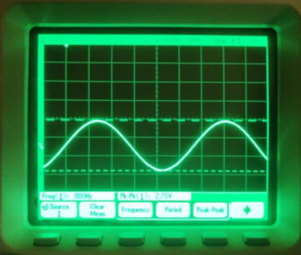
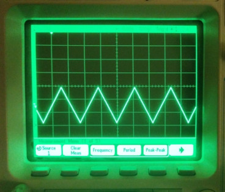
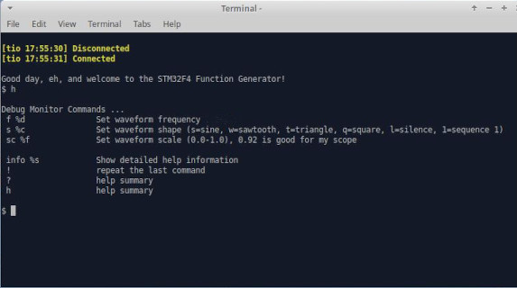

# STM32F4 Audio Function Generator

Open source audio function generator for the **STM32F4 Discovery board (STM32F407VGT6)**. Uses the F4's internal 12-bit DAC and DMA to stream waveforms with minimal CPU overhead.

Sine  |  Triangle
:-------------------------:|:-------------------------:
 |  

<br>

## Features
* **Waveforms:** Sine, Square, Triangle, Sawtooth, silence, and custom firmware defined pulse trains
* **Frequency Range:** 1 Hz to 22 kHz (will go higher, res decreases w/out hw filter)
* **Architecture:** 
  * Data is streamed to the internal 12-bit DAC via DMA  
  *(The external Cirrus Logic CS43L22 audio DAC is not used.)*
  * DAC conversion triggered by hardware timer, runs at a 400Khz conversion rate 

---

## Hardware & Analog Considerations

### Output Characteristics
* **Connection:** `DAC_OUT2` signal is mapped to **PA5** (Disco P1 pin 15)
* **DC Bias:** The DAC output runs in **unbuffered mode** and is DC-biased to midrange, ranging from `0V` to `3.3V`. 
* **Target Use:** Intended for debugging ADC inputs on separate MCU project/board. (I used this to debug an ADC/DSP/DAC chain on STM32H7.)  The DC biased signal allows you to connect the output directly to another MCU's ADC input without external biasing networks.

⚠️ **Important Loading Note:** The DAC output operates in unbuffered mode. Connecting a standard oscilloscope probe (~1 MΩ load) directly to PA5 introduces enough loading to prevent the DAC from swinging fully rail-to-rail, causing flat spots at the waveform peaks. To correct for this, the signal amplitude is digitally scaled to **92%** in firmware. (adjustable with the monitor `sc` command below)  
<br>
If you plan to drive low-impedance loads, buffering the output using a high-impedance op-amp circuit is highly recommended.  
<br>
To drive a bipolar ADC input without a bias, pass output through a High-Pass Filter (HPF) / blocking capacitor to remove the DC offset.  

### Peripheral Resource Conflicts
To free up **PA5** for `DAC_OUT2`, certain default Discovery board peripherals have been disabled in the CubeMX configuration:
* **SPI1** is disabled (shares PA5 for `SPI1_SCK`).
* **I2S3** is disabled to prevent conflicts with the onboard audio circuitry.
* **USB OTG FS** has been reconfigured to **Device Mode (Virtual COM Port)** to host the serial debug monitor.
* All other default peripherals (user LEDs, Blue Pushbutton, etc.) remain fully functional.

---

## Firmware Architecture & Code Details

This project has a clean separation between the autogenerated hardware abstraction layers and initialization code to prevent CubeMX from overwriting custom source code during code regeneration.  This also makes it easier to read/modify the function generator code.

* **Toolchain:** Generated as a CMake project via STM32CubeMX (v6.17.0) and compiled using the Linux command line via the GNU Arm Embedded Toolchain (`arm-none-eabi-gcc`).
* **Directory Structure:**
  * `Core/Src/` & `Core/Inc/` - Standard CubeMX-generated HAL and peripheral initializations.
  * `Core/app/` - Custom application code. 
  * `Core/app/dbgmon/` - Serial debug monitor source code.
* **Integration Hooks:** Core hooks are placed inside the `USER CODE` blocks of CubeMX's `main.c` and `USB_DEVICE/App/usbd_cdc_if.c` (`CDC_Receive_FS` function) to hand over execution to `app.c`.

### Debugging Utilities
Convenience macros are included in `Core/app/app.h` to control LEDs and their signals.  These can be used as visual flags or toggled to time ISRs with an oscilloscope.
* `SET_BLUE()` / `RESET_BLUE()` (PD15, Disco P1 pin 47)
* `SET_RED()` / `RESET_RED()` &nbsp;&nbsp;&nbsp;   (PD14, Disco P1 pin 46)

### DMA ISR Timing
At the 400Khz conversion rate, the window for processing a DMA buffer is around 1.28us.   The slowest shape generation is currently the sine wave.  Using the sinf() function in newlib with a release build, I have timed the DMA ISR at around 560us, which is roughly 44% of the available slice (i.e. plenty of time left, no need to optimize to a sine LUT, etc.)


---

## Build Instructions

This project uses a standard cross-compilation CMake build and the GNU Embedded ARM toolchain.
I used these tool versions from Ubuntu 22.04LTS (others may also work):
* arm-none-eabi-gcc (15:10.3-2021.07-4) 10.3.1 20210621 (release)
* cmake version 3.22.1
* STM32CubeMX v6.17.0 (not needed unless you want to change hw config)
* STM32Cube Programmer v2.22.0


### Initial Build
```bash
mkdir build
cd build
cmake -DCMAKE_TOOLCHAIN_FILE=../cmake/gcc-arm-none-eabi.cmake ..
make
```

### Incremental Rebuild
```bash
make
```

### Clean and Rebuild Code
```bash
make clean
make
```

### Rebuild Everything (including Makefiles) from Scratch
```bash
rm -rf build
mkdir build
cd build
cmake -DCMAKE_TOOLCHAIN_FILE=../cmake/gcc-arm-none-eabi.cmake ..
make clean
make
```

### Binaries
The build process generates `.elf` and `.map` files in the build directory.  The .elf is used for flashing via STM32CubeProgrammer or GDB.


---

## Serial Debug Monitor
Text-based "developer quality" serial monitor which interactivity controls the function generator's wave shape, frequency, and scale.  Based on a generic monitor written by friends, which I have modified and used on a bunch of different microcontroller projects.  Assumes code redirects stdin and stdout to a com port (done in app.c and usbd_cdc_if.c)  

Connect PC via the micro-USB OTG port at CN5 (not the ST-Link/power port at CN1.)   Use a serial terminal emulator (tio, PuTTY, etc) configured for 115200 8N1.  No additional drivers are required on modern Linux distributions.   Type `?` or `h` for list of commands


<br> ⚠️ You may need to adjust your terminal emulator's Local Echo, Line Feed (LF/CR), or Backspace settings for proper rendering.

<br><br>



<br><br><br><br><br>

